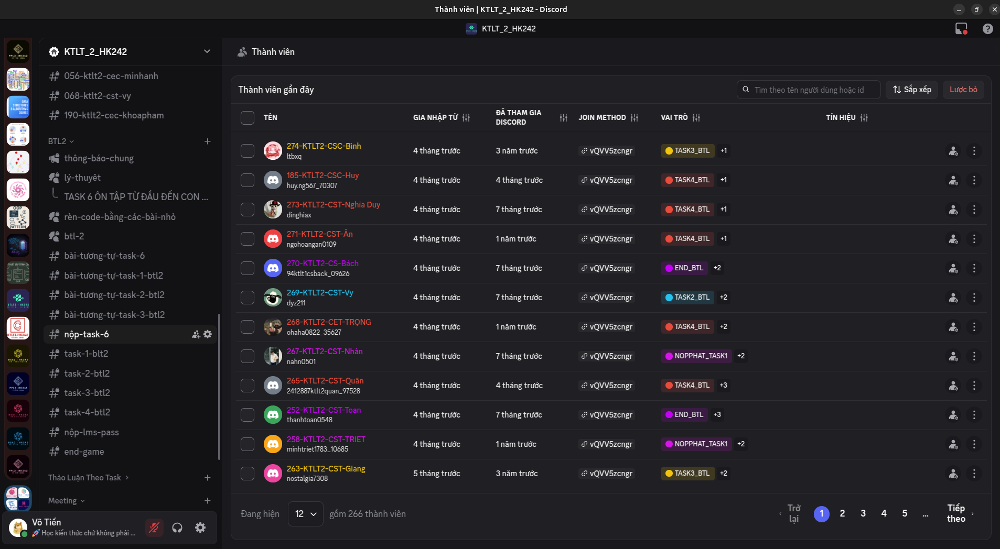
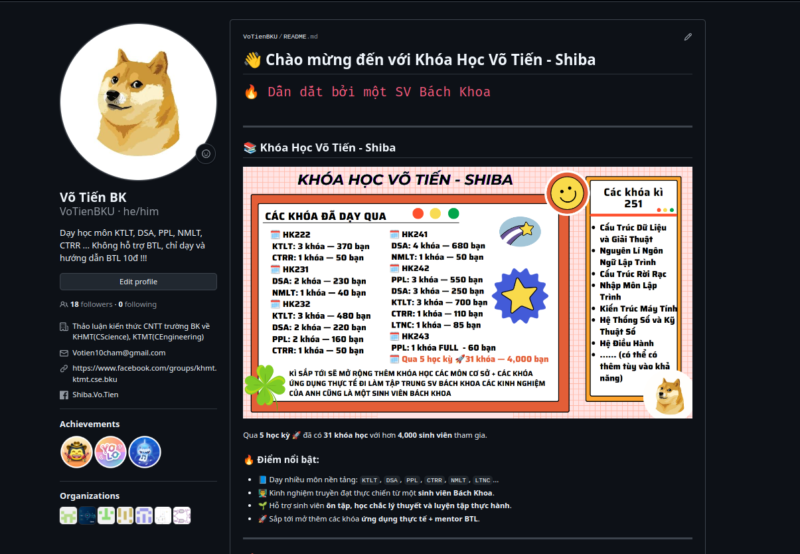

# Khóa Học HỆ THỐNG SỐ (TẶNG KÈM NHẬP MÔN ĐIỆN TOÁN) - HK251 

## 🎯 Mục tiêu
- Ôn tập GK và CK, hướng dẫn về lab sử dụng các tool mô phỏng 
- Tổng hợp và giải chi tiết các đề **GK, CK, Lab, BTL môn NMĐT tặng kèm**
- Có khả năng thiết kế mạch số để hỗ trợ các môn về sau và sẽ mở rộng các kiến thức cho môn KTMT học ở năm 2
- Hướng dẫn gõ LaTeX cho các bài lab một cách chuyên nghiệp, để có kiến thức ứng dụng gõ latex vào các BTL GT1 hay VL1

## 💰 Chính sách học phí theo nhóm (chỉ môn này thôi)

- Nhóm **3–4 người**: giảm **10%** cho mỗi bạn  
- Nhóm **từ 5 người trở lên**: giảm **15%** cho mỗi bạn  

## 📅 Lộ trình học

- Đề GK và CK sẽ được **chia theo từng chương**.  
- Mỗi chương đều có phần **Bài tập trắc nghiệm** được tổng hợp từ các đề GK/CK các năm trước.  
- Giúp ôn tập theo từng chương rõ ràng, vừa học lý thuyết vừa làm bài tập.  

| Buổi | Chủ đề | Nội dung chính |
|------|--------|----------------|
| 🟢 Buổi 1 | GK | Biểu diễn số đếm, mã và biến đổi mã |
| 🔵 Buổi 2 | GK | Đại số Boole & Các cổng luận lý |
| 🟡 Buổi 3 | GK | Các mạch luận lý tổ hợp |
| 🟠 Buổi 4 | GK | Các phép toán & mạch số học |
| 🟣 Buổi 5 | CK | Linh kiện mạch tuần tự |
| 🟤 Buổi 6 | CK | Bộ đếm & Thanh ghi |
| 🔴 Buổi 7 | CK | Mạch luận lý MSI |

## 📖 Cách học
- Sẽ có **meeting** trong các buổi giải để thảo luận và hướng dẫn  
- **Record** video để tham khảo lại nếu cần  
- **Discord** là nơi chính để học tập, `ID-chat-Tên`: Kênh riêng để **hỏi bài, trao đổi 24/7**   
- Tạo các **group GT1, VL1** cho các bạn có thể tạo luận

## 📌 Liên hệ
- 📘 Facebook Group: [Thảo luận kiến thức KHMT (CS) & KTMT (CE) trường BK](https://www.facebook.com/groups/khmt.ktmt.cse.bku)  
- 👤 Facebook cá nhân: [Shiba Võ Tiến Dạy học môn của ngành KHMT & KTMT HCMUT 4000+ Học Viên](https://www.facebook.com/Shiba.Vo.Tien)  
- 👤 GitHub cá nhân: [Shiba Võ Tiến](https://github.com/VoTienBKU)  

